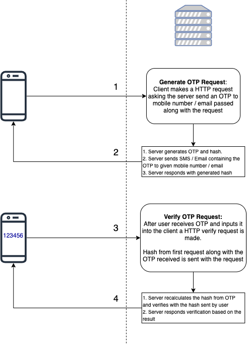

# simple-otp

A simple OTP Generation and Verification Library which works without a Database or Cache.

[](https://badge.fury.io/py/simple-otp)

## Features
* Does not require database or cache
* Easy to implement
* Has OTP expiry function

## How to use this?
Usage explained in diagram below



## Installation
```
pip install -U simple-otp
```

## Usage Example
```python
import os
from time import sleep
from simpleotp import OTP

SECRET_KEY = os.getenv('SECRET')

otp_handler = OTP(SECRET_KEY,
                  length=6,
                  expires_after=2,
                  user_identifier='kshitij.nagvekar@workindia.in')

# generate otp
otp, sig = otp_handler.generate()
print(otp, sig)

# verify otp
is_verified = otp_handler.verify(otp, sig)
print(is_verified) # True

is_verified = otp_handler.verify('123', sig)
print(is_verified) # False

sleep(2 * 61)
is_verified = otp_handler.verify(otp, sig)
print(is_verified) # False
```

The library also includes helper method to generate a random secret key
```python
from simpleotp import generate_secret

SECRET_KEY = generate_secret()
print(SECRET_KEY) # 'Q0CZYBRDECESA72M'
```

## Build Requirements
- Make
- Python
- Twine

## Initialise Build Environment
One time initialisation
```
make init
```

## Make a release build
1. Ensure that working directory is clean and all files are commited.
2. Bump the version. Please read [Semantic Version 2.0.0](http://semver.org/) before bumping versions.
   ```
   make release PART=[major/minor/patch]
   ```
3. Update the CHANGELOG.md.
4. Push release tags.
   ```
   git push origin --tags
   ```
5. Make a release build.
   ```
   make dist
   ```

## Publish your changes
```
make deploy
```

## Changelog

Please find the changelog here: [CHANGELOG.md](CHANGELOG.md)

## Authors

simple-otp was written by [Kshitij Nagvekar](mailto:kshitij.nagvekar@workindia.in).
